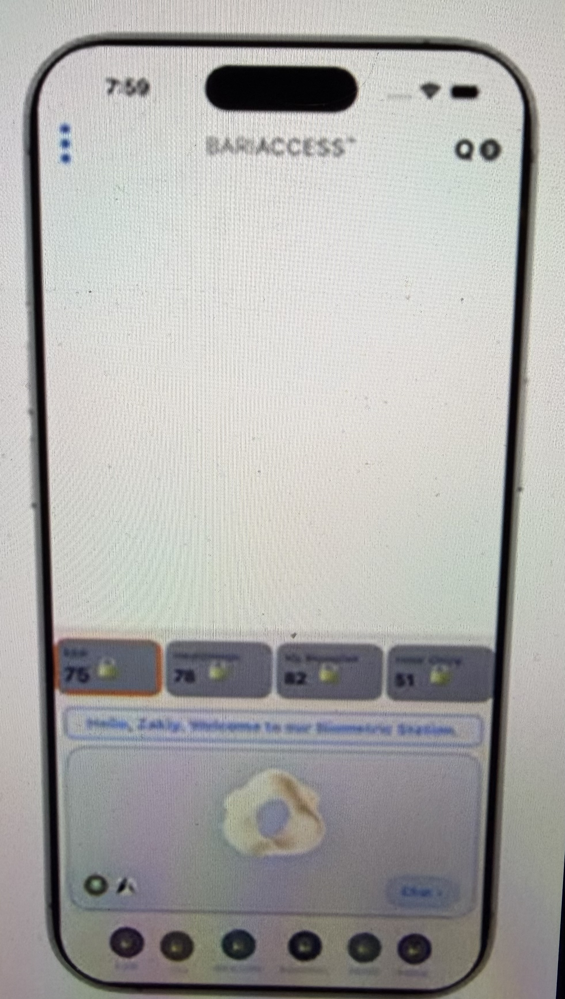
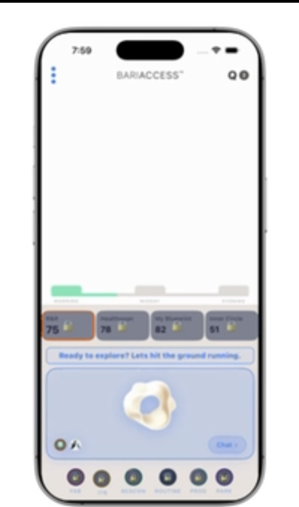
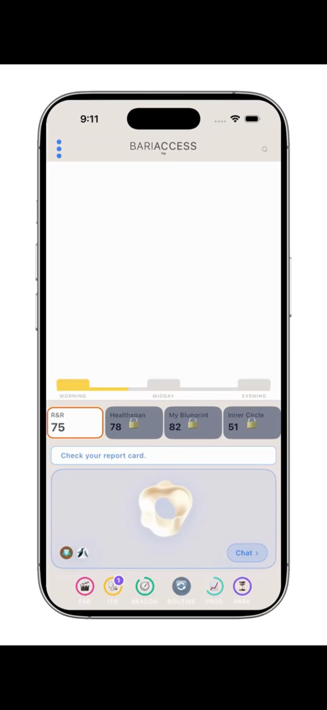
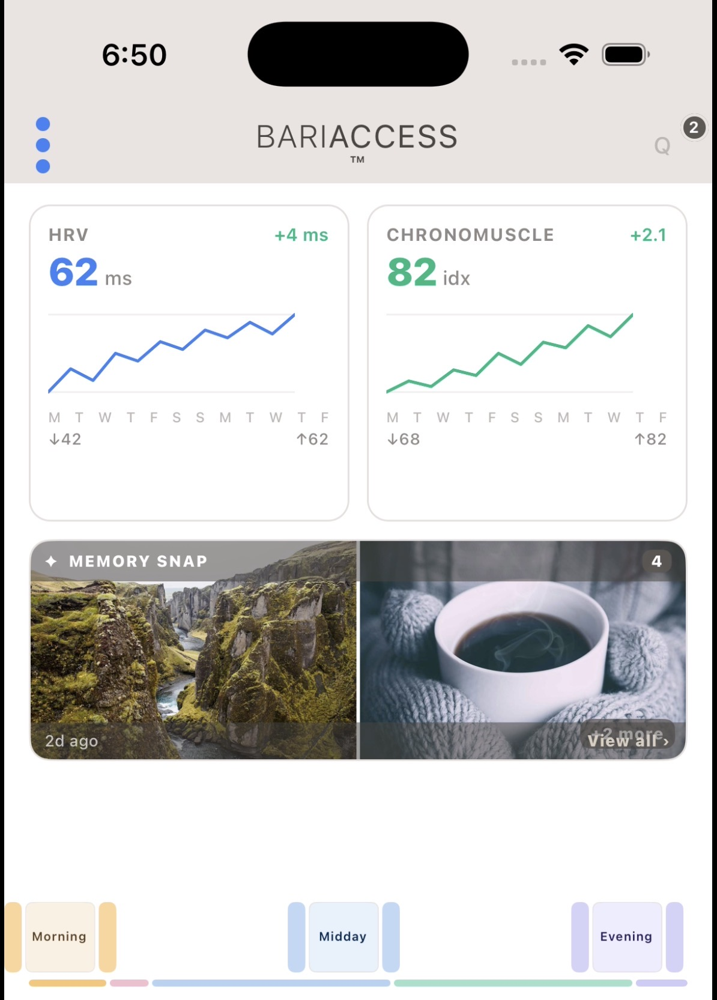
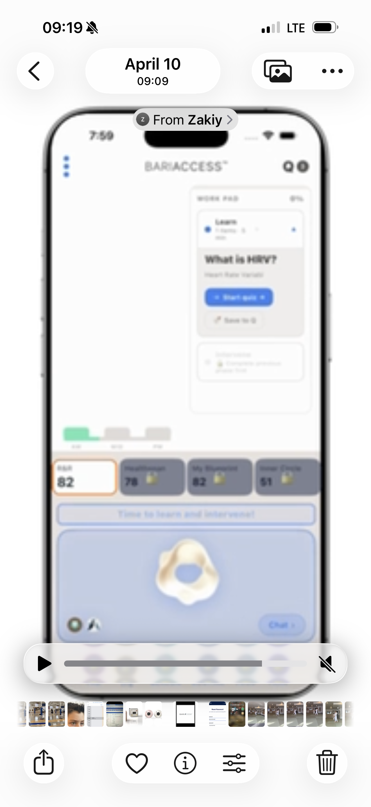
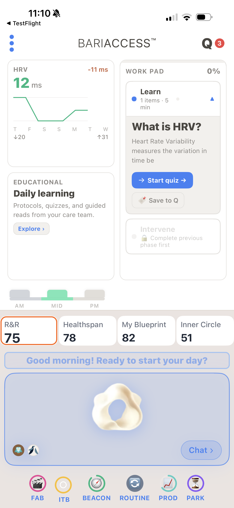

# BariAccess UX Canon · Phase 1 — Rhythm Board Foundation

## README_CODE — v1.0

**Phase:** 1 — Rhythm Board Foundation
**Cards:** SHOT-001 through SHOT-006
**Version:** v1.0
**Status:** 🟡 WIP (simulation pending)
**Author:** Valeriu E. Andrei, MD · President
**Entity:** BariAccess LLC
**Date:** April 22, 2026
**Intended reader:** Zakiy (lead developer) and the engineering team.

---

© 2026 BariAccess LLC. All rights reserved.
BariAccess™, RITHM™, and related marks are trademarks of BariAccess LLC.
Confidential — Internal use only.

---

## Preface — how to read this document

This document carries the **developer-facing specification** of the same six screenshots narrated in `README_HUMAN_v1.md`. The two documents are parallel: same cards, same order, same story, two dialects. A developer reading only this document should receive everything needed to implement the states and transitions shown. A developer reading both documents should see the same screen described twice — once as code, once as story.

### The Teaching Instance Rule — MUST READ BEFORE IMPLEMENTING

> *Every screenshot in this canon is a **teaching instance**, not a production specification. The shot is chosen to illustrate one concept clearly — a state, a layout, an expression, a resize behavior. The specific content visible in any given shot (cards, values, messages, colors, notification counts) is an **example** at this moment, not a fixed rule. Canonical takeaway = the rule being taught, not the specific example shown.*

**Implementation implication:** Do NOT hardcode values from the screenshots. Score values, card types, Ollie message strings, notification counts, delta colors, and Bookshelf segment colors are all runtime outputs of engines — the Beacon engine, the Program engine, the Expression Layer, the Ollie engine. Build the components to accept these values; do not bake them into the UI layer. Each card below calls out which elements are canonical (rules) and which are examples (runtime outputs).

### Two color systems — never cross-reference them

**System A — Beacon (algorithmic).** Seven bands computed by the SC formula. Lives on score-bearing displays when activated. Deep Green → Green → Faint Green → Very Light Green → Orange → Red → Dark Red. Computed output. Separate code path.

**System B — Expression Layer (Ollie-triggered).** Lives on five surfaces: Bookshelf, Signal Bar tile rims, Ollie's Space, AI Playground, Daily Pulse. Triggered by Ollie. Communicative, not algorithmic. Orange expression = Ollie attention call, same meaning on every surface. Green expression = in shape. Other colors may be added. Separate code path.

Same hex may appear in both systems. **That is a palette coincidence, not a link.** Build them as two independent systems.

### Rule #1 — Ollie owns all signals

No expression signal fires unless Ollie triggers it. Ollie is the conductor across all five Expression Layer surfaces.

---

## Card Index

| ID | Title | State ID | Surface | Phase · Step | Status |
|---|---|---|---|---|---|
| SHOT-001 | D0 Home View | `D0_INITIAL_LAUNCH` | Full app | 1 · 1 | 🟡 WIP |
| SHOT-002 | Bookshelf Green Morning | `D0_POST_BARISTA` | Full app | 1 · 2 | 🟡 WIP |
| SHOT-003 | Bookshelf Orange Morning | `DAILY_MORNING_ATTENTION` | Full app | 1 · 3 | 🟡 WIP |
| SHOT-004 | RB Two Cards + Memory Snap | `RB_IDLE_POPULATED` | Rhythm Board (zoom) | 1 · 4 | 🟡 WIP |
| SHOT-005 | Program WorkPad Vertical (dev capture) | `PROGRAM_ACTIVE_VERTICAL` | Full app | 1 · 5 | 🟡 WIP |
| SHOT-006 | Program WorkPad Vertical (clean) | `PROGRAM_ACTIVE_VERTICAL` | Full app | 1 · 6 | 🟡 WIP |

---

## SHOT-001 · D0 Home View



**Phase 1 · Step 1 · Status: 🟡 WIP**

> *Teaching Instance — this shot illustrates the rule described. Specific content shown is an example at this moment; actual content at runtime is engine-driven. Canonical takeaway = the rule, not the example.*

**Rule being taught:** At `D0_INITIAL_LAUNCH`, the Rhythm Board renders blank (child components unmounted), the Constellation Panel renders fully with all four Signal Bar tiles in `locked` state, and the Expression Layer is active independent of Beacon scoring.

**State ID:** `D0_INITIAL_LAUNCH`
**Surface:** Full app view — Rhythm Board (blank) + Constellation Panel (populated, locked)
**Triggered by:** First app open post-onboarding, before first Barista session
**Leads to:** SHOT-002 (Bookshelf first appearance, post-Barista engagement)

### Layout spec — top to bottom

**Top Bar (persistent across all states):**
- Left: Three Dots menu component
- Center: BariAccess™ wordmark
- Right: Q icon + BariAccess logo icon (logo holds BioSnaps and Rhythm Signals — functional element, not decorative)

**Rhythm Board (upper ~2/3 of viewport):**
- State: `BLANK` — no cards rendered, no Memory Snap rendered, no Routine Bookshelf rendered
- Background: white, clean
- Implementation: Rhythm Board container present; child components unmounted at this state

**Constellation Panel (lower ~1/3, always mounted):**

*Row 1 — Signal Bar (Constellation Crown™):*
- Four tiles, fixed order, non-rearrangeable: R&R, Healthspan, My Blueprint, Inner Circle
- Each tile at D0: score display (placeholder/demo value) · padlock icon visible · `rim_state` controlled by Expression Layer
- Example in this shot: 75, 78, 82, 51 — these are placeholder demo values. Actual values set by engine at runtime.
- Beacon band colors do NOT activate until tile `unlocked=true`
- Rim color system: **Expression Layer only** — Ollie-triggered. Distinct code path from Beacon.

*Row 2 — Ollie's Space:*
- Message container (pill shape, light background, blue text)
- Behavior: steady, no marquee, ~17 words max per CCO-UX-OLLIE-001
- Example string in this shot: *"Hello, Zakiy. Welcome to our Biometric Station."* — runtime string from Ollie engine

*AI Playground (between Ollie's Space and Daily Pulse):*
- Morpheus component: amorphous shape, `color` controlled by Ollie state (D0 default: cream)
- Left accessory icons: owl (Ollie) + triangle (AskABA)
- Right: "Chat" button (primary CTA)
- Active state: compact (always present pre-engagement)
- Triggers expansion: user taps Chat → AI Playground opens between Row 2 and Daily Pulse (does NOT cover full panel)

*Row 5 — Daily Pulse:*
- Six trackers in fixed order: FAB, ITB, BEACON, ROUTINE, PROD, PARK
- At D0: uniform quiet (no notification badges, no active Expression Layer colors)
- Each tracker: Tap = Blip Card · Press ≥2s = Press Card (TikTok-style program cards)
- Tracker colors + notification badges driven by Expression Layer + Program engine at runtime

### Expression Layer state (example in this shot)

- R&R tile: orange rim — Ollie attention call — default focus invitation
- All other surfaces: neutral
- *Note: this is one valid output. Expression Layer may light any tile or tracker orange at D0 if the engine determines that is the appropriate focus target.*

### Component flags for Zakiy

```
rhythm_board.bookshelf         : unmounted at D0; mounts on first Barista engagement (SHOT-002 state)
signal_bar.tiles[i].padlock    : boolean, tied to tile.unlocked status
signal_bar.tiles[i].rim_color  : controlled by Expression Layer, NOT Beacon. Distinct code path.
ai_playground.morpheus.color   : default cream · changes per Ollie state (purple = Max engaged, etc.)
score_values, ollie_messages,
tracker_states, notification_counts : ALL engine-driven at runtime — do not hardcode
```

### Canon refs

CCO-CP-ARCH-001 · CCO-UX-RBDISP-001 v1.2 (D0 blank) · CCO-UX-EXPR-001 (Expression Layer, Ollie-triggered) · Beacon Canon v1.1 (band activation gated by unlock) · CCO-UX-OLLIE-001 (Ollie's Space steady message).

### Open questions for simulation

- Exact timing of Bookshelf mount event (post-Barista session completion?)
- Whether all four tiles unlock simultaneously at ~Day 7–10 or progressively

---

## SHOT-002 · Bookshelf Green Morning



**Phase 1 · Step 2 · Status: 🟡 WIP**

> *Teaching Instance — this shot illustrates the rule described. Specific content shown is an example at this moment; actual content at runtime is engine-driven. Canonical takeaway = the rule, not the example.*

**Rule being taught:** Routine Bookshelf mounts at the bottom of the Rhythm Board after the first Barista engagement event. Once mounted, it is persistent across all subsequent states (until resize during program activation — see SHOT-005/006). The Bookshelf renders segment bars that accept Expression Layer color states.

**State ID:** `D0_POST_BARISTA` (first state where Bookshelf is mounted)
**Surface:** Full app view
**Triggered by:** First Barista session completion event
**Leads to:** Any state where Bookshelf persists (SHOT-003, SHOT-004, etc.)

### Layout spec — delta from SHOT-001

Everything from `D0_INITIAL_LAUNCH` persists, with these changes:

**Rhythm Board:**
- `rhythm_board.bookshelf` component now **mounted** at the bottom of the Rhythm Board
- Bookshelf renders three umbrella labels: `MORNING` · `MIDDAY` · `EVENING` (full label form at idle)
- Each umbrella contains a segment bar component
- Segment bar color: driven by Expression Layer
- Example in this shot: MORNING bar is green (`expression.state = "in_shape"`), MIDDAY and EVENING bars are neutral (no expression fired)

**Constellation Panel:**
- Signal Bar: all four tiles still locked in this shot (example — padlock state is `tile.unlocked` per-tile)
- Ollie's Space: example string — *"Ready to explore? Let's hit the ground running."*
- R&R rim: orange expression persists (Ollie attention call)
- AI Playground and Daily Pulse: unchanged from D0

### Expression Layer state (example in this shot)

- Bookshelf MORNING bar: green (in shape / on track)
- R&R tile rim: orange (Ollie attention call)
- All other surfaces: neutral

### Component flags for Zakiy

```
rhythm_board.bookshelf.mounted        : true after first Barista engagement event
rhythm_board.bookshelf.umbrellas      : ["MORNING", "MIDDAY", "EVENING"] — fixed order, fixed labels at idle
rhythm_board.bookshelf.segment[i]     : each segment accepts Expression Layer color state
rhythm_board.bookshelf.segment[i].color : NEVER maps to Beacon. Expression Layer code path only.
```

### Canon refs

CCO-UX-RBDISP-001 v1.2 (Bookshelf mount rule) · CCO-UX-RBSHELF-001 (Bookshelf governance) · CCO-UX-EXPR-001 (green = in shape).

### Notes

Green segment bar is an Expression Layer signal, not a Beacon band. The Expression Layer paints the Bookshelf the same way it paints tile rims and other surfaces. Rule #1: Ollie owns all signals.

---

## SHOT-003 · Bookshelf Orange Morning



**Phase 1 · Step 3 · Status: 🟡 WIP**

> *Teaching Instance — this shot illustrates the rule described. Specific content shown is an example at this moment; actual content at runtime is engine-driven. Canonical takeaway = the rule, not the example.*

**Rule being taught:** Bookshelf segment bars accept any Expression Layer color state. Orange on a segment bar carries the same semantic as orange anywhere else in the Expression Layer: Ollie calling for customer attention. Orange on multiple surfaces at the same time is canonical (surfaces can express in unison).

**State ID:** `DAILY_MORNING_ATTENTION` (example state — represents any state where morning segment triggers attention expression)
**Surface:** Full app view
**Triggered by:** Expression Layer evaluation determines morning segment requires customer attention
**Leads to:** Any state where customer has responded or Expression Layer updates

### Layout spec — delta from SHOT-002

**Rhythm Board:**
- Bookshelf MORNING segment bar: orange (`expression.state = "attention"`)
- MIDDAY and EVENING: neutral

**Constellation Panel:**
- Ollie's Space: example string — *"Check your report card."* (directive tone, paired with orange segment expression)
- R&R tile: **padlock removed** (example state — `tile.unlocked = true` for R&R). Orange rim persists.
- Other tiles: still locked in this shot (example)
- Daily Pulse: trackers now displaying distinct Expression Layer colors (example progression from SHOT-002 quiet state)
- Daily Pulse ITB tracker: `notification_badge = 1` (example — first ITB queued)

### Expression Layer state (example in this shot)

- Bookshelf MORNING bar: orange (attention)
- R&R tile rim: orange (attention)
- Ollie's Space: paired directive tone
- Daily Pulse ITB: notification badge
- **Multi-surface expression in unison** is a canonical pattern — surfaces reinforce each other.

### Component flags for Zakiy

```
expression_layer.surfaces[]           : array of expression-capable surfaces (Bookshelf segments, tile rims, Ollie's Space, Morpheus, Daily Pulse trackers)
expression_layer.surfaces[i].state    : Ollie-triggered color state
expression_layer.surfaces[i].color    : resolved from state (orange = attention, green = in shape, etc.)
daily_pulse.tracker[i].notification   : integer badge count, Expression Layer driven
signal_bar.tiles[i].unlocked          : boolean — when true, Beacon band can activate (still separate from rim)
```

### Canon refs

CCO-UX-RBDISP-001 v1.2 · CCO-UX-EXPR-001 (orange = Ollie attention call) · CCO-UX-RBSHELF-001 · Beacon Canon v1.1 (tile unlock).

### Forward observations (parked)

- ITB notification badge ("1") — notification system pattern across Daily Pulse. Canon needed in future phase.
- Q icon notification count increases — notification system also present on top-bar Q. Canon needed.

---

## SHOT-004 · RB Two Cards + Memory Snap



**Phase 1 · Step 4 · Status: 🟡 WIP**

> *Teaching Instance — this shot illustrates the rule described. Specific content shown is an example at this moment; actual content at runtime is engine-driven. Canonical takeaway = the rule, not the example.*

**Rule being taught:** The Rhythm Board's default populated idle layout contains two content cards (full-width, stacked side-by-side at the top), a Memory Snap slot (full-width, below the cards), and the Routine Bookshelf (full-width, at the bottom). Cards are content cards of any supported type (biometric, educational, other — extensible). Card selection is gated by infusion of knowledge from programs and locked by a 72-hour commitment rule. An optional third card converts the layout into four equal quadrants with Memory Snap resized.

**State ID:** `RB_IDLE_POPULATED` (default idle layout with cards placed)
**Surface:** Rhythm Board (this shot is zoomed to RB only; Constellation Panel is off-frame but still mounted beneath)
**Triggered by:** Customer has earned and placed at least Card 1 and Card 2 via program engagement
**Leads to:** `PROGRAM_ACTIVE_VERTICAL` (SHOT-005/006) when a program launches

### Layout spec — two-card default

```
┌──────────────────┬──────────────────┐
│                  │                  │
│     Card 1       │     Card 2       │
│   (full-width    │   (full-width    │
│    of left half) │   of right half) │
│                  │                  │
├──────────────────┴──────────────────┤
│                                     │
│           Memory Snap               │
│          (full-width)               │
│                                     │
├─────────────────────────────────────┤
│    MORNING · MIDDAY · EVENING       │  ← Bookshelf full-width at bottom
└─────────────────────────────────────┘
```

**Card spec (idle layout, 2-card default):**
- Each card occupies ~50% of Rhythm Board width, full width of its half
- Card height: accommodates a metric headline, delta, and a 12-day trend chart
- Card types: **extensible** — biometric, educational, other types supported; card component accepts a `card_type` prop
- Example in this shot: Card 1 = HRV (biometric), Card 2 = Chronomuscle (biometric). Runtime selection is Program-driven.

**Memory Snap spec:**
- Full-width horizontal slot below the two cards
- Can hold: 1 image, 2 images, or video
- Example in this shot: 2 images + "+2 more" indicator showing additional memories stored
- Behavior: client controls content freely inside the Memory Snap; shell activation is governed, content inside is not

**Bookshelf spec:**
- Full-width at bottom of Rhythm Board
- Umbrella labels: full form (`MORNING` · `MIDDAY` · `EVENING`)
- Segment bars and FAB indicators live inside the umbrella zones
- Colors: Expression Layer

### Three-card option — equal quadrants

When customer adds a third card:

```
┌──────────────────┬──────────────────┐
│     Card 1       │     Card 2       │
├──────────────────┼──────────────────┤
│     Card 3       │  Memory Snap     │  ← Memory Snap resized,
│                  │  (shows first    │    shows picture 1
│                  │   picture only)  │    by default
├──────────────────┴──────────────────┤
│    MORNING · MIDDAY · EVENING       │
└─────────────────────────────────────┘
```

All four quadrants are **equal in size**. Cards and Memory Snap share the same compressed template dimensions.

### 72-Hour Commitment Rule

- On `card_place` event: `card.locked_until = now + 72h`
- While `card.locked_until > now`: no card swap or removal permitted
- After 72h: card change permitted, but change must be triggered by new program engagement (infusion of knowledge gate)
- Matches CCO-PROG-001 v2.1 (locked)

### Component flags for Zakiy

```
rhythm_board.layout_mode             : "two_card" | "three_card"
rhythm_board.cards[]                 : array of content card instances
rhythm_board.cards[i].card_type      : "biometric" | "educational" | <future types>
rhythm_board.cards[i].locked_until   : timestamp — 72h commitment gate
rhythm_board.memory_snap.mode        : "full_width" (2-card layout) | "quadrant_compressed" (3-card layout)
rhythm_board.memory_snap.default_picture : picture_1 when in quadrant_compressed mode
```

### Canon refs

CCO-UX-RBDISP-001 v1.2 (populated layout, two-card rule) · CCO-PROG-001 v2.1 (72-hour commitment, card types) · CCO-UX-RBSHELF-001 (Bookshelf persistence) · Content Card Types (canon needed).

### Notes

Shot is cropped to Rhythm Board only. Constellation Panel is off-frame but remains mounted. Equal-quadrant specification for the 3-card mode is canonically locked — Card 1, Card 2, Card 3, and resized Memory Snap all occupy identical dimensions in that mode.

---

## SHOT-005 · Program WorkPad Vertical (dev capture)



**Phase 1 · Step 5 · Status: 🟡 WIP**

> *Teaching Instance — this shot illustrates the rule described. Specific content shown is an example at this moment; actual content at runtime is engine-driven. Canonical takeaway = the rule, not the example.*

**Rule being taught:** When a program launches, the Rhythm Board splits vertically. The Program WorkPad occupies the right half, full top-to-bottom of the Rhythm Board. The left half compresses: cards stack vertically in the left column; Memory Snap (or third card) drops off entirely; the Routine Bookshelf compresses in both dimensions (height AND width) and sits **only beneath the left column**, under the cards. The Program WorkPad on the right runs unbroken — no Bookshelf beneath it. The Constellation Panel below remains fully intact.

**State ID:** `PROGRAM_ACTIVE_VERTICAL`
**Surface:** Full app view
**Triggered by:** Program launch event (from Row 1 tap, Q tab, Parking Lot reactivation, or other canonical program-trigger per CCO-PROG-001 v2.1)
**Leads to:** Program state transitions (Learn complete → Intervene unlock) or `RB_IDLE_POPULATED` on program completion/exit

### Layout spec

```
┌──────────────────┬───────────────────┐
│                  │                   │
│  Card 1          │                   │
│  (compressed     │                   │
│   left column)   │                   │
│                  │   PROGRAM         │
├──────────────────┤   WORK PAD        │
│                  │   (right half,    │
│  Card 2          │    full height    │
│  (compressed     │    top to bottom) │
│   left column)   │                   │
│                  │                   │
├──────────────────┤                   │
│  AM · MID · PM   │                   │  ← Bookshelf under left column only
└──────────────────┴───────────────────┘
│      CONSTELLATION PANEL (unchanged)  │
└───────────────────────────────────────┘
```

**Left column (compressed cards + Bookshelf):**
- Cards stack vertically: Card 1 top, Card 2 bottom
- Card dimensions: compressed from full-width idle to half-width-of-left-half
- Cards are mixed-type (same rule as SHOT-004 — biometric, educational, other)
- Memory Snap and third card (if present in idle): **dropped** during program active
- Bookshelf below cards: compressed height, compressed width (left-column width only)
- Bookshelf labels compressed to `AM` · `MID` · `PM`

**Right column (Program WorkPad):**
- Position: right half of Rhythm Board
- Height: unbroken, full top-to-bottom of Rhythm Board (no Bookshelf strip beneath)
- Component: Program WorkPad shell per CCO-ARCH-SHELL-001
- Content: program phase cards (Learn, then Intervene — sequential gate)
- Header: "WORK PAD" label + progress percent
- Example in this shot: Learn phase active ("What is HRV?" · Start quiz · Save to Q), Intervene phase locked ("Complete previous phase first")

**Constellation Panel:** unchanged — full width, all rows present.

### Branch Point Rule (from CCO-PROG-001 v2.1)

- Program phases execute sequentially
- Learn must complete before Intervene unlocks
- Intervene phase visible but locked (`🔒 Complete previous phase first`) until Learn completion event fires
- Learn completion = valid terminal state (`Complete Lite`) — partial CCIE credits awarded, 72-hour Parking Lot hold permitted

### Component flags for Zakiy

```
rhythm_board.layout_mode                  : "program_active_vertical"
rhythm_board.left_column.cards[]          : stacked vertical, compressed dimensions
rhythm_board.left_column.bookshelf        : compressed BOTH height AND width; sits under cards only
rhythm_board.left_column.bookshelf.labels : ["AM", "MID", "PM"] — compressed form
rhythm_board.right_column.program_workpad : full top-to-bottom of RB, no Bookshelf strip beneath
rhythm_board.memory_snap                  : unmounted in this state
program.phase.learn.status                : "active" | "complete_lite" | "locked" | "complete"
program.phase.intervene.status            : "locked" (until Learn complete) | "active" | "complete"
constellation_panel                       : unchanged from idle states
```

### Canon refs

CCO-UX-RBDISP-001 v1.2 (vertical split · Bookshelf compression) · CCO-PROG-001 v2.1 (Learn → Intervene gate, Branch Point Rule) · CCO-ARCH-SHELL-001 (Program WorkPad as Shell) · CCO-UX-EXPR-001 (green segment bar expression persists through resize).

### Notes

Provenance: developer video capture from Zakiy, April 10, 2026. Blur is an artifact of the capture method, not the build. SHOT-006 shows the same state in clean form.

**Critical visual learning for implementation:** Bookshelf compresses in BOTH dimensions — height AND width. It sits only under the cards, NOT under the Program WorkPad. The Program WorkPad runs unbroken from top of RB to bottom of RB.

---

## SHOT-006 · Program WorkPad Vertical (clean)



**Phase 1 · Step 6 · Status: 🟡 WIP**

> *Teaching Instance — this shot illustrates the rule described. Specific content shown is an example at this moment; actual content at runtime is engine-driven. Canonical takeaway = the rule, not the example.*

**Rule being taught:** Same `PROGRAM_ACTIVE_VERTICAL` state as SHOT-005, captured cleanly. Validates: (a) cards stack vertical left, (b) cards are mixed-type content (this shot shows biometric + educational), (c) Program WorkPad occupies right half unbroken, (d) Bookshelf compressed under cards only, (e) Constellation Panel unchanged with all four tiles unlocked (example — later in customer journey than SHOT-002/003).

**State ID:** `PROGRAM_ACTIVE_VERTICAL` (same as SHOT-005)
**Surface:** Full app view
**Triggered by:** Same as SHOT-005
**Leads to:** Same as SHOT-005

### Layout spec — validates SHOT-005 spec, additional detail

All spec from SHOT-005 applies. Additional observations from the clean capture:

**Left column cards (example content):**
- Top: biometric card — HRV with delta display. Delta color coding: green for positive, warm tones (orange/red) for negative.
- Bottom: educational card — "Daily learning" with category label, description, and CTA (`Explore ›`)
- **Confirms cards accept mixed types simultaneously** — Card 1 biometric, Card 2 educational, running in the same program-active state.

**Right column Program WorkPad (example content):**
- Header: "WORK PAD" + "0%" progress indicator
- Learn phase active: "1 items · 5 min" metadata · "What is HRV?" title · subtitle · primary CTA "Start quiz" · secondary CTA "Save to Q"
- Intervene phase locked: "🔒 Complete previous phase first"

**Bookshelf (compressed, under left column only):**
- Labels: `AM` · `MID` · `PM`
- Example expression: MID bar green (midday in shape)

**Constellation Panel (example progression):**
- Signal Bar: all four tiles unlocked in this shot (example — customer is past unlock gate for all four). R&R carries orange rim (Ollie attention expression).
- Ollie's Space: example string — *"Good morning! Ready to start your day?"*
- AI Playground: cream Morpheus, owl + triangle icons, Chat button
- Daily Pulse: all six trackers in distinct Expression Layer colors (FAB, ITB, BEACON, ROUTINE, PROD, PARK)

### Component flags for Zakiy — additional from SHOT-006

```
rhythm_board.left_column.cards[0].card_type  : "biometric" (example)
rhythm_board.left_column.cards[1].card_type  : "educational" (example)
biometric_card.delta.color_convention        : green (positive delta) | warm tones (negative delta) — Expression Layer convention
educational_card.cta                         : "Explore ›" (example)
program_workpad.header.progress_pct          : integer 0-100
signal_bar.tiles[].unlocked                  : all true in this example (customer past unlock gate)
top_bar.q.notification_count                 : integer (example in this shot: 3)
```

### Canon refs

CCO-UX-RBDISP-001 v1.2 · CCO-PROG-001 v2.1 · CCO-ARCH-SHELL-001 · CCO-UX-EXPR-001 · Content Card Types (canon needed — confirms biometric + educational types exist; extensibility for future types).

### Notes

- TestFlight banner confirms beta build — provenance note for handoff.
- Q notification count of 3 is an example state, not canonical.
- Card types shown (HRV biometric + Daily Learning educational) are examples of valid content; runtime assignment is Program-driven.
- Delta color convention in biometric cards (green/positive, warm/negative) is an inferred Expression Layer rule from this example — needs explicit canon entry.

---

## End of README_CODE v1.0

Phase 1 — Rhythm Board Foundation, six cards, all 🟡 WIP pending simulation.

Implementation notes: all engine-driven values (scores, messages, colors, counts, card types) must remain dynamic. Component flags above are the stable contract between UI layer and engines.

---

© 2026 BariAccess LLC · Valeriu E. Andrei MD · President · Confidential — Internal use only.
