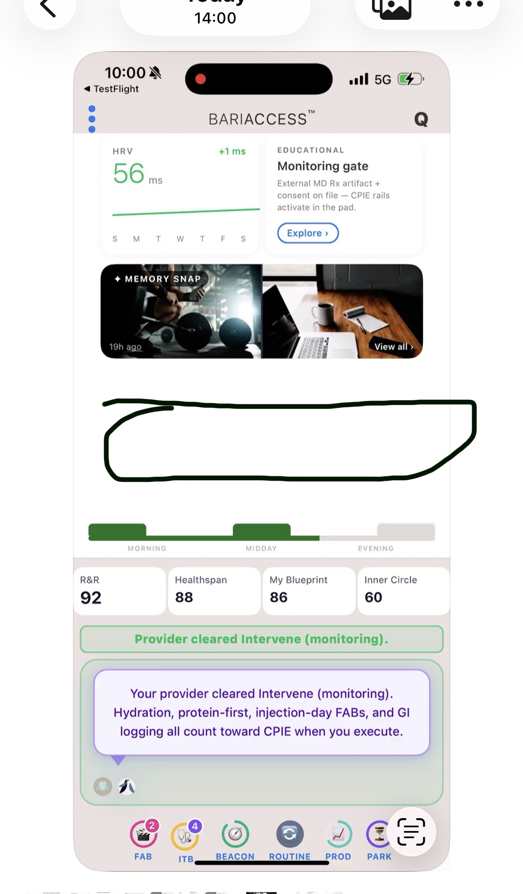
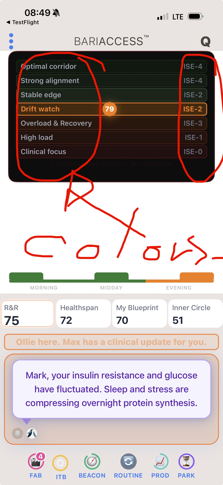
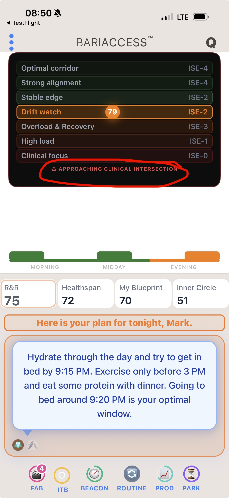
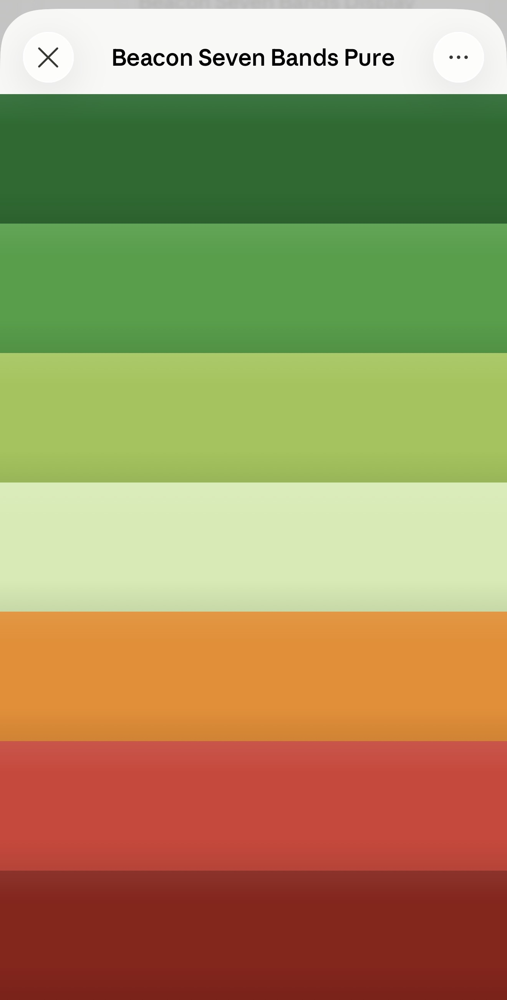
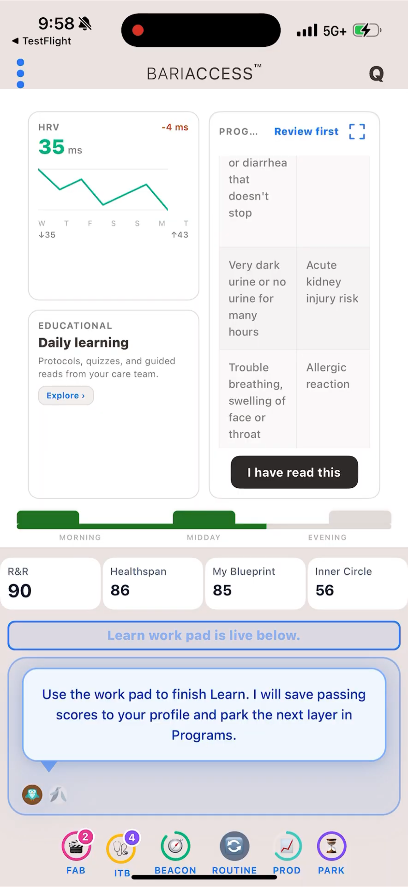
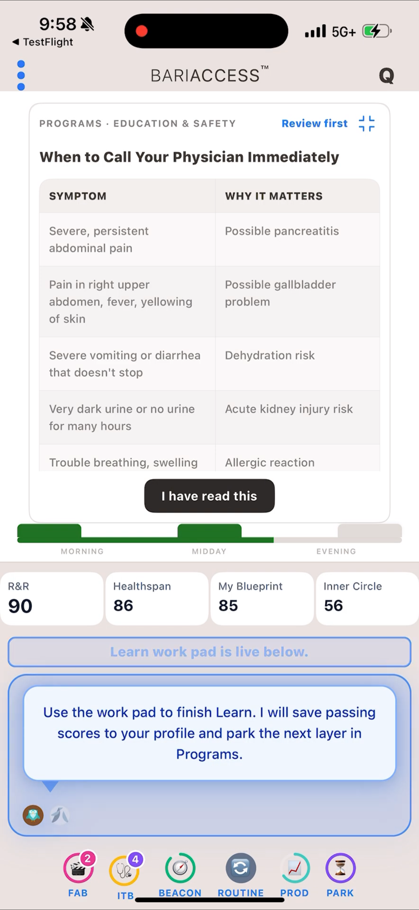
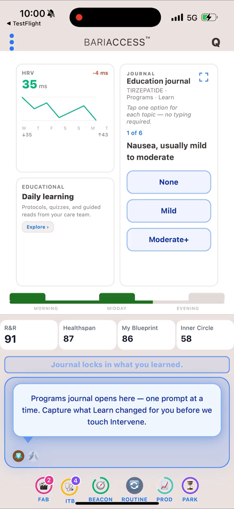
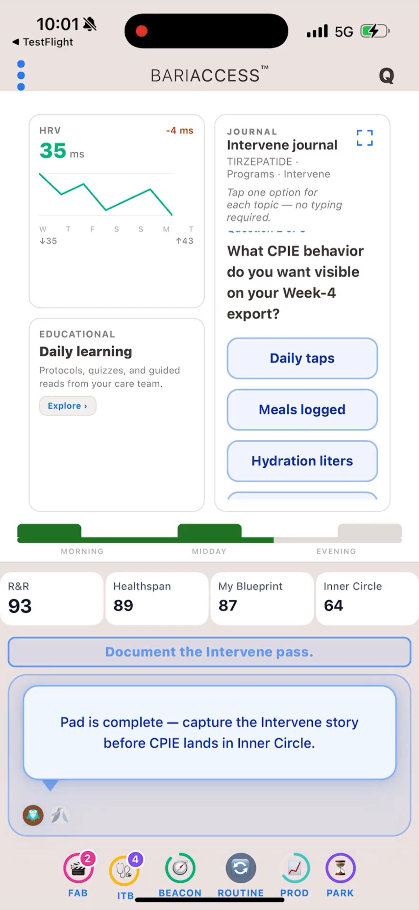
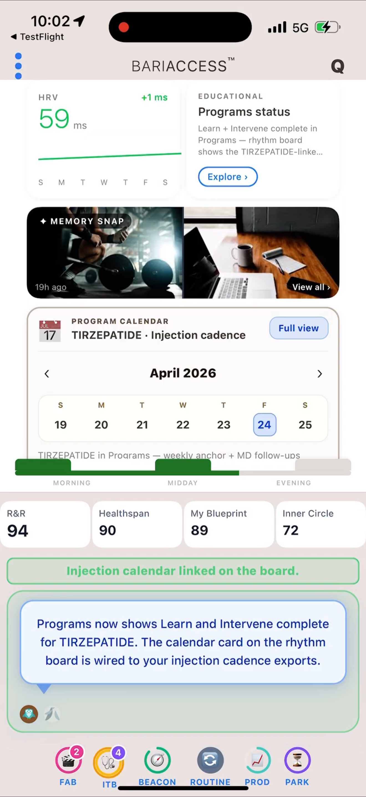
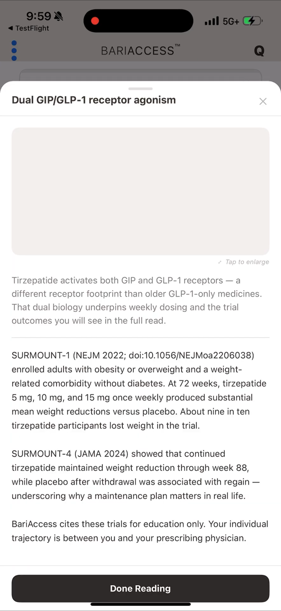

# BariAccess UX Canon · Phase 1 + Phase 2

## README_HUMAN — v1.2

**Phases:** 1 — Rhythm Board Foundation · 2 — Content Governance
**Cards:** SHOT-001 through SHOT-017
**Version:** v1.2
**Status:** Mixed (see card index)
**Author:** Valeriu E. Andrei, MD · President
**Entity:** BariAccess LLC
**Date:** April 22, 2026

---

© 2026 BariAccess LLC. All rights reserved.
BariAccess™, RITHM™, and related marks are trademarks of BariAccess LLC.
Confidential — Internal use only.

---

## Opening note — from Val

> *v1.2 closes with a clear commitment. Going forward, every change to the Rhythm Board, the Constellation Panel, and the content that lives on them will be analyzed together as a team — aligned before it ships. Two lines we protect carefully: HIPAA compliance, and the canonical integrity of the Rhythm Board and Constellation Panel. No display crosses both surfaces at the same time. No customer-facing content ships without review. This version captures the guardrails; the next versions will build the work that earns them.*
>
> — Val

---

## Preface — how to read this document

This is the human narrative across two phases now. Phase 1 laid the foundation — the Rhythm Board, the Bookshelf, the Constellation Panel, the Program WorkPad resize. Phase 2 is about content governance — catching internal acronyms before they reach the customer, locking the Beacon canonical display, defining how ITBs must appear, and making room for new committed concepts (Journal, Program Calendar) whose mechanics are still being worked out.

The parallel `README_CODE_v1.2.md` tells the same story in developer language. The three role briefings (`README_ZAKIY`, `README_MARKETING`, `README_RESEARCH`) sit on top of both.

### The Teaching Instance Rule

> *Every screenshot in this canon is a **teaching instance**, not a production specification. The shot is chosen to illustrate one concept clearly. The specific content visible (cards, values, messages, colors, notification counts) is an example at that moment, not a fixed rule. Canonical takeaway = the rule being taught, not the specific example shown.*

### Phase 1 narrative (SHOT-001 through SHOT-006)

See v1.0.2 included in this bundle for the full Phase 1 narrative. The foundation is: structure before demand, rhythm instantiated through the Bookshelf, multi-surface expression, earned personalization with the 72-hour rule, programs as sacred time with Branch Point Rule, and data-learning integration.

### Phase 2 narrative — what this phase is about

Phase 2 caught a pattern: internal acronyms were leaking into customer-facing copy. The canon was speaking, but sometimes it was speaking in our language, not the customer's. Phase 2 is where we rewrite those voices, catch the contradictions, and lock the guardrails — Content Governance, ITB display rules, the Beacon canonical display as pure color — before we build more.

---

## Card Index (Phase 2)

| ID | Title | Phase · Step | Status |
|---|---|---|---|
| SHOT-007 | Max Message — Content Governance | 2 · 1 | 🔴 Contradiction |
| SHOT-008 | Rhythm Board White Gap | 2 · 2 | 🔴 Contradiction |
| SHOT-009+010 | Beacon — Text Must Be Removed | 2 · 3 | 🔴 Contradiction (combined) |
| SHOT-011 | Beacon Canonical Display (Pure Bands) | 2 · 4 | 🟢 Reference |
| SHOT-012 | ITB Half-Display | 2 · 5 | 🔴 Contradiction |
| SHOT-013 | ITB Full-Width Partial | 2 · 6 | 🔴 Contradiction |
| SHOT-014 | Education Journal (Learn phase) | 2 · 7 | 🟡 WIP |
| SHOT-015 | Intervene Journal | 2 · 8 | 🟡 WIP |
| SHOT-016 | Program Calendar (Tirzepatide) | 2 · 9 | 🟡 WIP |
| SHOT-017 | Full-Screen Content Overlay | 2 · 10 | 🔴 + 🟡 |

---

## SHOT-007 · Max Message — Content Governance

**Phase 2 · Step 1 · Status: 🔴 Contradiction · Surface: AI Playground · State: Max speaking**

> *Teaching Instance — this shot captures a Max message as it shipped. The content is flawed; the canonical rule being taught is the correction.*

**The story.**

Max speaks in the AI Playground. That is his only surface. When the customer sees a purple message, Max is the one talking. This shot captured a Max message that shipped with internal language the customer was never meant to see — acronyms like PQIS and CCIE, protocol terms like *label titration* and *mechanism*. Copy for engineering docs, not for the person in front of the screen.

**Original copy (as shipped, flawed):**
*"Learn teaches mechanism, label titration, safety, and the PQIS gate — CCIE engagement, no clinical action inside the app."*

**Corrected copy (canonical):**
*"Learn with Max. Earn recognition credits along the way. When you're ready, Ollie guides you to your next program — where your credits can be redeemed."*

- Word count: 25
- Characters with spaces: 152
- Characters without spaces: 127

Max gives the customer an invitation, not a lecture. He names himself. He names Ollie. He names the credits as *recognition*, not points. He names the redemption loop — credits unlock the next program — without explaining the mechanic. Ollie will walk the customer through the how when the moment comes.

**Canon refs:** CCO-UX-SCREENS-001 §22 (Content Governance) · CCO-UX-EXPR-001 (Max in AI Playground).

**Notes:** This shot is the reason §22 Content Governance exists. From v1.2 forward, no Max or Ollie copy ships without team review.

---

## SHOT-008 · Rhythm Board White Gap

**Phase 2 · Step 2 · Status: 🔴 Contradiction · Surface: Rhythm Board**

> *Teaching Instance — this shot captures a UI bug. The rule being taught is that this empty space must never exist.*

**The story.**

Between the Memory Snap and the Routine Bookshelf, the Rhythm Board shows an empty white gap. There is no canonical state where this should exist. Every region of the Rhythm Board is accounted for: cards above, Memory Snap below, Bookshelf at the bottom. When a program launches, the WorkPad takes over and the cards resize. When an ITB fires, per CCO-UX-ITB-DISP-001 §2, the entire Rhythm Board is covered. There is no state in which white space should appear in the middle.

**Canon refs:** CCO-UX-RBDISP-001 v1.2 · CCO-UX-ITB-DISP-001 v1.0 WIP.

**Notes:** Implementation bug. The Rhythm Board component must never render an uncovered region. If content is unmounted, another component must take its place — or the layout itself must reshape per canonical resize rules.

---

## SHOT-009 + SHOT-010 · Beacon — Text Must Be Removed

**Phase 2 · Step 3 · Status: 🔴 Contradiction (combined) · Surface: Beacon display**

> *Teaching Instance — two shots, one teaching. Both illustrate that the Beacon display must be colors only, no text of any kind.*

**The story.**

The Beacon is a contextual corridor, not a data table. Its job is to show the customer where they stand in their corridor without naming bands, without labeling ISE states, without warning banners. The Beacon speaks in color.

**SHOT-009** shows internal state names ("Optimal corridor," "Strong alignment," "Stable edge," "Drift watch," "Overload & Recovery," "High load," "Clinical focus") in the left column and ISE labels ("ISE-4," "ISE-2," "ISE-3," "ISE-1," "ISE-0") in the right column. None of these belong in the customer-facing Beacon.

**SHOT-010** shows an additional warning banner: "⚠ APPROACHING CLINICAL INTERSECTION." Also must be removed. The Beacon does not issue text warnings. Ollie handles communication. The Beacon handles the visual state.

**The canonical Beacon is SHOT-011** — seven colored bands, nothing else.

**Canon refs:** Beacon Canon v1.1 · CCO-UX-EXPR-001 · `Beacon_Seven_Bands_Pure.html` (attached reference).

**Notes:** Internal state names and ISE labels are engineering vocabulary. They belong in dashboards for Val, Pamela, and the advisory board — not on the customer's screen.

---

## SHOT-011 · Beacon Canonical Display (Pure Bands)

**Phase 2 · Step 4 · Status: 🟢 Reference · Surface: Beacon display (canonical)**

> *Teaching Instance — this is not a WIP shot. This is the canonical reference for how the Beacon must display in the customer-facing app.*

**The story.**

Seven color bands, stacked top to bottom: Deep Green · Green · Faint Green · Very Light Green · Orange · Red · Dark Red. No labels. No warnings. No numbers. No text. Just the corridor, spoken in color.

This is the HTML file `Beacon_Seven_Bands_Pure.html`, attached to this bundle, rendered on a phone. It is the binding reference for Zakiy and for anyone checking Beacon implementation.

**Canon refs:** Beacon Canon v1.1 · `Beacon_Seven_Bands_Pure.html`.

**Notes:** Colors are tuned for screen readability. If the advisory board or clinical team want exact hex locks, those go into the Beacon Canon directly — this reference shows the visual pattern.

---

## SHOT-012 · ITB Half-Display

**Phase 2 · Step 5 · Status: 🔴 Contradiction · Surface: Rhythm Board during ITB**

> *Teaching Instance — this shot shows an ITB running in a split-screen layout. The rule being taught is that this is NOT canonical.*

**The story.**

In this shot, the ITB ("When to Call Your Physician Immediately") is running in the right half of the Rhythm Board, while cards still show on the left and the Constellation Panel is visible below. CCO-UX-ITB-DISP-001 §2 is explicit: when an ITB is triggered, the ITB opens to full screen. Everything else is hidden. No Constellation Panel. No Daily Pulse. No other tiles.

This shot violates that rule. The ITB is not being given its full attention. The customer is being presented with clinical safety content alongside their regular dashboard — the opposite of what the ITB exists to do.

**Canon refs:** CCO-UX-ITB-DISP-001 v1.0 WIP §2 · CCO-PROG-001 v2.1.

**Notes:** Structural contradiction. The implementation must force ITB full-screen on trigger.

---

## SHOT-013 · ITB Full-Width Partial

**Phase 2 · Step 6 · Status: 🔴 Contradiction · Surface: Rhythm Board during ITB**

> *Teaching Instance — closer to canonical than SHOT-012, but still not compliant.*

**The story.**

The same ITB, now taking the full width of the Rhythm Board. Better. But the Constellation Panel and Daily Pulse remain visible at the bottom of the screen. Per CCO-UX-ITB-DISP-001 §2, those should also be hidden. The ITB must be the ONLY thing the customer sees.

**Canon refs:** CCO-UX-ITB-DISP-001 v1.0 WIP §2.

**Notes:** Partial compliance is still contradiction. The ITB rule is binary — either fully hidden everything else, or it's not an ITB.

---

## SHOT-014 · Education Journal (Learn phase)

**Phase 2 · Step 7 · Status: 🟡 WIP · Surface: Rhythm Board component (candidate)**

> *Teaching Instance — a committed concept in early form. The Journal must happen; the how, when, and where are still being worked out.*

**The story.**

A Journal component has appeared in the upper-right of the Rhythm Board during a Learn phase. It asks the customer tap-only questions ("Nausea, usually mild to moderate" with None / Mild / Moderate+ buttons) in a 1-of-6 sequence. The intent is beautiful: capture what Learn changed for the customer, in their own words (or taps), before moving to Intervene.

But the mechanics are not locked. The Journal may trigger earlier than Learn completion. It may not be a separate component at all — it may fold into the Learn phase itself, where an answer to a Learn question doubles as a journal entry. It may be subtle. It must be simple.

**Journal concept = committed.** Details = WIP.

**Canon refs:** CCO-UX-SCREENS-001 §22 (content review needed for prompts).

**Notes:** The prompt copy shown is illustrative. Final prompts and triggers are for team determination.

---

## SHOT-015 · Intervene Journal

**Phase 2 · Step 8 · Status: 🟡 WIP · Surface: Rhythm Board component (candidate)**

> *Teaching Instance — same concept as SHOT-014, now at the Intervene phase.*

**The story.**

The Journal also appears after Intervene — asking the customer what CPIE behavior they want visible on their Week-4 export. Three tap options (Daily taps / Meals logged / Hydration liters / and more below).

The problem shown: the prompt itself uses *CPIE* and *Week-4 export* — internal vocabulary. The Max bubble also leaks protocol language: *"Pad is complete — capture the Intervene story before CPIE lands in Inner Circle."* Same governance issue as SHOT-007. The Journal concept works; the copy does not.

**Canon refs:** CCO-UX-SCREENS-001 §22.

**Notes:** All shown prompts and messages go through content governance before shipping. Journal concept committed, prompts TBD.

---

## SHOT-016 · Program Calendar (Tirzepatide)

**Phase 2 · Step 9 · Status: 🟡 WIP · Surface: Rhythm Board component (candidate)**

> *Teaching Instance — a committed calendar concept for medication programs. Must exist. Exact layout is WIP.*

**The story.**

For medication programs like Tirzepatide, the Rhythm Board shows a Program Calendar — injection cadence, weekly anchor, MD follow-ups. In this shot it appears as a horizontal block between the Memory Snap and the Bookshelf. Whether that is the right position, the right size, or the right shape is not yet locked.

**Hard rule:** the Calendar must not jam the Rhythm Board. No induced scroll.

**Candidate layouts (all WIP):** full horizontal · partial horizontal · upper or lower half · full-view expansion via dedicated button.

**Canon refs:** CCO-UX-RBDISP-001 v1.2 · CCO-UX-SCREENS-001 §22 (content review).

**Notes:** Medication-class ITB content is especially sensitive. The Calendar must support injection cadence clarity without introducing clutter.

---

## SHOT-017 · Full-Screen Content Overlay

**Phase 2 · Step 10 · Status: 🔴 Contradiction + 🟡 WIP · Surface: Full-screen overlay (unauthorized)**

> *Teaching Instance — this shot shows an overlay that covers both the Rhythm Board and the Constellation Panel. This was never approved. It violates the scaffold principle. The content it holds may be valuable; the delivery mechanism is not canonical.*

**The story.**

A full-screen overlay titled "Dual GIP/GLP-1 receptor agonism" appears, covering both the Rhythm Board and the Constellation Panel. It carries real clinical content — SURMOUNT-1 (NEJM 2022), SURMOUNT-4 (JAMA 2024), and a respectful boundary line: *"BariAccess cites these trials for education only. Your individual trajectory is between you and your prescribing physician."* The content is grounded. The delivery is not.

Per v1.2 canon, no display covers both Rhythm Board and Constellation Panel simultaneously except a canonically-defined ITB. This is not an ITB. It is an untethered surface.

**Four candidate delivery forms (all appropriate, can coexist):**
1. In-app card on the Rhythm Board with swipe method between content pieces
2. Archive / history / library the customer can browse
3. Downloadable PDF sent to the customer
4. Web app access, PDF-style display, for the customer's own records

**Canon refs:** CCO-UX-SCREENS-001 §22 (HIPAA + scaffold guardrails) · CCO-UX-RBDISP-001 v1.2.

**Notes:** Preserve the substance (citations, boundary line). Retire the delivery. Team chooses the canonical home.

---

## End of README_HUMAN v1.2

Phase 1 — Rhythm Board Foundation · six cards, all 🟡 WIP pending simulation.
Phase 2 — Content Governance · eleven cards (including SHOT-011 🟢 Reference), mix of 🔴 Contradiction and 🟡 WIP.

v1.2 is closed. Next upload begins v1.3.

---

© 2026 BariAccess LLC · Valeriu E. Andrei MD · President · Confidential — Internal use only.
